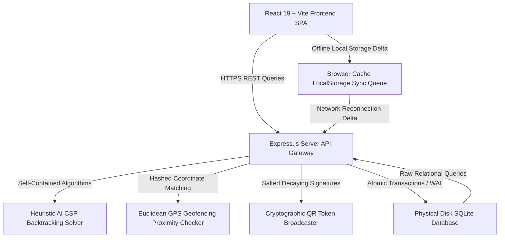

# 🌌 ABES GO | Elite College ERP & Proximity Attendance Portal

<div align="center">

[](https://opensource.org/licenses/MIT)
[](https://react.dev/)
[](https://vitejs.dev/)
[](https://nodejs.org/)
[](https://expressjs.com/)
[](https://sqlite.org/)

**An agency-grade, award-winning college administration portal custom-tailored for ABES Engineering College.**  
Designed with sleek obsidian-dark aesthetics, real-time geofenced check-ins, cryptographic dynamic signature QR codes, and Heuristic AI timetables solvers.

[✨ Live Demo Aesthetics](#-design-system--qclay-aesthetics) • [🚀 Windows Quick Start](#-getting-started-windows-quick-start) • [📐 System Architecture](#-system-architecture--visual-telemetry) • [🔑 Pre-Seeded Credentials](#-demonstration-security-credentials)

</div>

---

## 🎨 Design System & QClay Aesthetics

Inspired by the clean, responsive, and neon-highlighted interface patterns of [QClay Design](https://qclay.design/?ref=dribbble), the user experience features:
* **Obsidian-Dark Theme**: Base canvas color set to `#040406` with glowing, soft radial gradient background nebulas (`.aurora-backdrop`).
* **Capsule Navigation Rows**: Elegant floating tab-select capsules (`.qclay-subnav-capsule`) with custom hover transitions and translucent inactive items.
* **Micro-Border QClay Cards**: Border-rounded panels (`28px` corner radius) styled with deep black `#09090d` panels and paper-thin borders (`1px solid rgba(255,255,255,0.04)`).
* **Holographic Micro-Animations**: Shimmering lighting sweeps (`.qclay-hologram-glow`) that decorate invoice balances, syllabus items, and schedules.

---

## ⚡ Primary Operational Capabilities

### 1. Heuristic AI Constraint Satisfaction (CSP) Timetable Scheduler
* **State Machine**: Powered by a recursive backtracking solver (`solveTimetableCSP`) that allocates course blocks with absolute conflict immunity.
* **Constraints Checked**:
  * **Classroom Boundaries**: Cohort size must not exceed room seating capacity.
  * **Room Conflicts**: No two lectures can occupy the same room at the same time window.
  * **Instructor Conflicts**: Instructors cannot be double-booked to teach multiple classes in the same slot.
* **Telemetry**: Automatically compiles coordinate grid allocations into a dynamic occupancy density matrix (Heatmap).

### 2. Proximity GPS Geofencing Blueprint Map
* **Coordinate Algorithms**: Employs flat plane Euclidean coordinate calculations (`calculateGeodistance`) to verify student check-in positions.
* **Proximity Threshold**: Student GPS coordinates must reside within a strict **15-meter** limit of the classroom's coordinates.
* **Visual Map**: Renders an interactive vector campus grid displaying active scan sweeps, pulsing nodes, and boundary indicators in real-time.

### 3. Cryptographic Time-Decaying QR Signatures
* **Token Rotation**: Generates secure attendance check-in tokens re-computed every **15 seconds** combining timestamps, coordinates, and secure salts.
* **Anti-Screenshot Integrity**: Enforces a strict **30-second** token decay window. Check-in requests using shared screenshots or outdated tokens are automatically blocked.

### 4. What-If SGPA Target Simulator
* **Interactive Sliders**: High-end range controls allow students to project hypothetical grades dynamically on the client side.
* **Scholarship Protections**: Instantly flags Honours Standing divisions, outputting alerts if projected SGPAs slide below the **8.50 Honours retention limit** required for academic waivers.

### 5. Local Cache Sync Queue
* **Offline Operations**: Caches roster attendance submissions inside `localStorage` when client-to-server networks fail.
* **Reconciliation Sync**: Automatically resolves and synchronizes dirty offline queues back to the central SQLite ledger once network connectivity returns.

### 6. Escrow Bursar Ledgers & Invoice Spooler
* **Auditing Timeline**: Settles transaction balances in real-time. Tracks Paid, Unpaid, and Pending wire statement receipts.
* **Authorized Spooler**: Generates printable PDF statement formats of grades transcripts and fees statements with custom authorized bursar seals.

---

## 📐 System Architecture & Visual Telemetry



---

## 🗃 Relational Database Schema Model (SQLite DDL)

The physical database engine resides at `server/abes_erp.db`. Below is the complete relational architecture:

```
  +------------------+          +------------------+          +------------------+
  |      users       | <------+ |     students     | <------+ |  student_grades  |
  +------------------+          +------------------+          +------------------+
  | id (PK)          |          | id (PK)          |          | id (PK)          |
  | email            |          | user_id (FK)     |          | student_id (FK)  |
  | password         |          | student_id_num   |          | course_id (FK)   |
  | role             |          | attendance_rate  |          | marks_obtained   |
  +------------------+          +------------------+          | grade_letter     |
           ^                             ^                    +------------------+
           |                             |                             ^
           +---------------+             +---------------+             |
                           |                             |             |
  +------------------+     |    +------------------+     |    +------------------+
  |      staff       | <---+    |     invoices     | <---+    |     courses      |
  +------------------+          +------------------+          +------------------+
  | id (PK)          |          | id (PK)          |          | id (PK)          |
  | user_id (FK)     |          | student_id (FK)  |          | code             |
  | employee_id_num  |          | total_amount     |          | title            |
  | department       |          | status           |          | credits          |
  +------------------+          +------------------+          +------------------+
           ^                             ^                             ^
           |                             |                             |
           |                             |                             |
  +------------------+          +------------------+          +------------------+
  |    schedules     | <------+ |  invoice_items   |          |    syllabus      |
  +------------------+          +------------------+          +------------------+
  | id (PK)          |          | id (PK)          |          | id (PK)          |
  | course_id (FK)   |          | invoice_id (FK)  |          | course_id (FK)   |
  | instructor_id(FK)|          | name             |          | unit_name        |
  | room_id (FK)     |          | amount           |          | coverage_percent |
  +------------------+          +------------------+          +------------------+
```

<details>
<summary>📜 Click to expand the Database DDL Scripts</summary>

```sql
-- 1. Identity credentials
CREATE TABLE IF NOT EXISTS users (
  id TEXT PRIMARY KEY,
  email TEXT UNIQUE NOT NULL,
  password TEXT NOT NULL,
  role TEXT CHECK(role IN ('admin', 'faculty', 'student')) NOT NULL,
  created_at TIMESTAMP DEFAULT CURRENT_TIMESTAMP
);

-- 2. Scholar Profiles
CREATE TABLE IF NOT EXISTS students (
  id TEXT PRIMARY KEY,
  user_id TEXT UNIQUE NOT NULL,
  student_id_number TEXT UNIQUE NOT NULL,
  first_name TEXT NOT NULL,
  last_name TEXT NOT NULL,
  date_of_birth TEXT NOT NULL,
  enrollment_status TEXT CHECK(enrollment_status IN ('ACTIVE', 'SUSPENDED', 'ON_LEAVE', 'GRADUATED')) DEFAULT 'ACTIVE',
  program TEXT NOT NULL,
  admission_year INTEGER NOT NULL,
  contact_number TEXT NOT NULL,
  emergency_contact TEXT NOT NULL,
  attendance_rate REAL DEFAULT 100.0,
  FOREIGN KEY(user_id) REFERENCES users(id) ON DELETE CASCADE
);

-- 3. Academic Schedules
CREATE TABLE IF NOT EXISTS schedules (
  id TEXT PRIMARY KEY,
  course_id TEXT NOT NULL,
  instructor_id TEXT NOT NULL,
  room_id TEXT NOT NULL,
  day TEXT CHECK(day IN ('Monday', 'Tuesday', 'Wednesday', 'Thursday', 'Friday')) NOT NULL,
  time_window TEXT CHECK(time_window IN ('09:00 - 10:30', '10:30 - 12:00', '13:00 - 14:30', '14:30 - 16:00')) NOT NULL,
  FOREIGN KEY(course_id) REFERENCES courses(id) ON DELETE CASCADE,
  FOREIGN KEY(instructor_id) REFERENCES staff(id) ON DELETE CASCADE,
  FOREIGN KEY(room_id) REFERENCES rooms(id) ON DELETE CASCADE,
  UNIQUE(room_id, day, time_window),
  UNIQUE(instructor_id, day, time_window)
);

-- 4. Attendance Check-ins
CREATE TABLE IF NOT EXISTS attendance (
  id TEXT PRIMARY KEY,
  student_id TEXT NOT NULL,
  schedule_id TEXT NOT NULL,
  status TEXT CHECK(status IN ('PRESENT', 'ABSENT', 'LATE', 'EXCUSED')) NOT NULL,
  recorded_by TEXT NOT NULL,
  timestamp TEXT NOT NULL,
  latitude REAL,
  longitude REAL,
  FOREIGN KEY(student_id) REFERENCES students(id) ON DELETE CASCADE,
  FOREIGN KEY(schedule_id) REFERENCES schedules(id) ON DELETE CASCADE,
  UNIQUE(student_id, schedule_id, timestamp)
);
```

</details>

---

## 🔑 Demonstration Security Credentials

The relational database is pre-seeded with **12 student profiles**, **9 class schedules**, and **12 tuition billing statements**. Use the pre-configured credentials below to check role-based dashboard synchronization:

<details>
<summary>📂 View Registrar / Administrator Credentials</summary>

* **Email:** `admin@abes.edu`
* **Password:** `admin123`
* **Privileges**:
  * Execute Heuristic AI timetables solvers dynamically.
  * Audit ledger accounts and authorize/reject pending wire statement receipts.
  * Broadcast campus critical notifications on the alert marquee.
  * View institutional security action audit trails.

</details>

<details>
<summary>📂 View Academic Professor (Faculty) Credentials</summary>

* **Email:** `sandeep@abes.edu` or `meenakshi@abes.edu`
* **Password:** `sandeep123` or `meenakshi123`
* **Privileges**:
  * Submit student batch rosters attendance logs.
  * Update student grades registries (dynamic marks-to-letter conversions).
  * Update syllabus unit coverage progression percentages.
  * Initialize time-decay secure QR broadcasters.

</details>

<details>
<summary>📂 View College Scholar (Student) Credentials</summary>

* **Email:** `liam@abes.edu` (also pre-seeded: `dev@abes.edu`, `priya@abes.edu`, `aanya@abes.edu`)
* **Password:** `liam123` (password matches email username + `123`)
* **Privileges**:
  * Verify coordinate-based geofence check-ins.
  * Use What-If SGPA target simulators.
  * Download authorized transcripts and fees statement PDFs.
  * Simulate direct bursar checkouts.

</details>

---

## 🚀 Getting Started (Windows Quick Start)

The workspace includes a self-contained batch launcher script that installs packages and boots up the active processes concurrently:

```powershell
# 1. Clone or download the repository into your workspace
git clone https://github.com/shashank-tomar0/ABES-GO.git abes-go
cd abes-go

# 2. Execute the launcher script in PowerShell or Command Prompt
.\run.bat
```

> [!NOTE]
> `run.bat` automatically verifies node packages installation, configures physical SQLite schemas inside `server/abes_erp.db`, boots up the API Express backend server at `http://localhost:3001`, and launches the React client application at `http://localhost:5173`.

---

## 📱 Mobile & Local Network Sharing

To share and interact with the ERP on your smartphone, tablet, or secondary computer on the same Wi-Fi network:

1. Identify your local hosting PC's IPv4 address by opening Command Prompt and running `ipconfig` (e.g. `192.168.1.45`).
2. Open your device's web browser and navigate to `http://<PC-IP>:5173/` (e.g. `http://192.168.1.45:5173/`).
3. The React Single Page Application will auto-detect the hosting environment and securely route all transaction queries to the backend API running at `http://<PC-IP>:3001`.