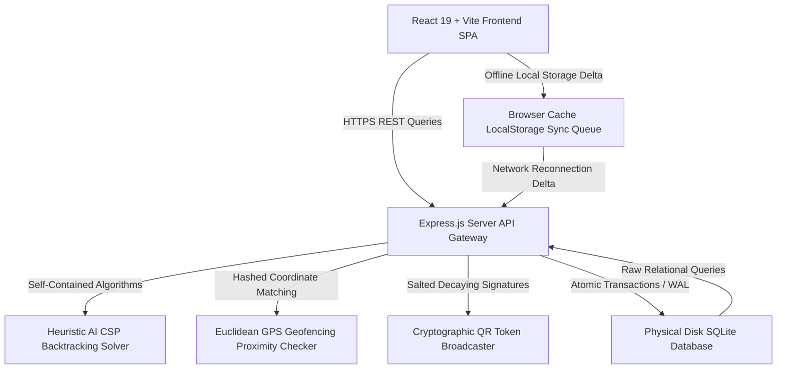

# 🌌 ABES GO | Elite College ERP & Proximity Attendance Portal

> **An award-winning agency-grade university administration platform.** Custom-tailored for **ABES Engineering College**, designed from first-principles with premium obsidian dark aesthetics, real-time geofence tracking, cryptographic signature check-ins, and Heuristic AI schedulers.

---

## 📐 System Architecture & Visual Telemetry

The platform maps modular services into a high-performance relational framework:



---

## 💎 Primary Operational Capabilities

### 1. Heuristic AI Constraint Satisfaction (CSP) Timetable Scheduler
* **State Machine**: Powered by a recursive backtracking solver (`solveTimetableCSP`) that allocates course blocks with absolute conflict immunity.
* **Constraints Checked**:
  * **Classroom Boundaries**: Cohort size must not exceed room seating capacity.
  * **Room Conflicts**: No two lectures can occupy the same room at the same time window.
  * **Instructor Conflicts**: Instructors cannot be double-booked to teach multiple classes in the same slot.
* **Telemetry**: Automatically compiles coordinate grid allocations into a dynamic occupancy density matrix (Heatmap).

### 2. Proximity GPS Geofencing Blueprint Map
* **Coordinate Algorithms**: Employs flat plane Euclidean coordinate calculations (`calculateGeodistance`) to verify student check-in positions.
* **Proximity Threshold**: Student GPS coordinates must reside within a strict **15-meter** limit of the classroom's coordinates.
* **Visual Map**: Renders an interactive vector campus grid displaying active scan sweeps, pulsing nodes, and boundary indicators in real-time.

### 3. Cryptographic Time-Decaying QR Signatures
* **Token Rotation**: Generates secure attendance check-in tokens re-computed every **15 seconds** combining timestamps, coordinates, and secure salts.
* **Anti-Screenshot Integrity**: Enforces a strict **30-second** token decay window. Check-in requests using shared screenshots or outdated tokens are automatically blocked.

### 4. What-If SGPA Target Simulator
* **Interactive Sliders**: High-end range controls allow students to project hypothetical grades dynamically on the client side.
* **Scholarship Protections**: Instantly flags Honours Standing divisions, outputting alerts if projected SGPAs slide below the **8.50 Honours retention limit** required for academic waivers.

### 5. Local Cache Sync Queue
* **Offline Operations**: Caches roster attendance submissions inside `localStorage` when client-to-server networks fail.
* **Reconciliation Sync**: Automatically resolves and synchronizes dirty offline queues back to the central SQLite ledger once network connectivity returns.

### 6. Escrow Bursar Ledgers & Invoice Spooler
* **Auditing Timeline**: Settles transaction balances in real-time. Tracks Paid, Unpaid, and Pending wire statement receipts.
* **Authorized Spooler**: Generates printable PDF statement formats of grades transcripts and fees statements with custom authorized bursar seals.

---

## 🗃 Relational Database Schema Model (SQLite)

The ledger stores records across 11 relational tables mapped with indexing keys:

```
  +------------------+          +------------------+          +------------------+
  |      users       | <------+ |     students     | <------+ |  student_grades  |
  +------------------+          +------------------+          +------------------+
  | id (PK)          |          | id (PK)          |          | id (PK)          |
  | email            |          | user_id (FK)     |          | student_id (FK)  |
  | password         |          | student_id_num   |          | course_id (FK)   |
  | role             |          | attendance_rate  |          | marks_obtained   |
  +------------------+          +------------------+          | grade_letter     |
           ^                             ^                    +------------------+
           |                             |                             ^
           +---------------+             +---------------+             |
                           |                             |             |
  +------------------+     |    +------------------+     |    +------------------+
  |      staff       | <---+    |     invoices     | <---+    |     courses      |
  +------------------+          +------------------+          +------------------+
  | id (PK)          |          | id (PK)          |          | id (PK)          |
  | user_id (FK)     |          | student_id (FK)  |          | code             |
  | employee_id_num  |          | total_amount     |          | title            |
  | department       |          | status           |          | credits          |
  +------------------+          +------------------+          +------------------+
           ^                             ^                             ^
           |                             |                             |
           |                             |                             |
  +------------------+          +------------------+          +------------------+
  |    schedules     | <------+ |  invoice_items   |          |    syllabus      |
  +------------------+          +------------------+          +------------------+
  | id (PK)          |          | id (PK)          |          | id (PK)          |
  | course_id (FK)   |          | invoice_id (FK)  |          | course_id (FK)   |
  | instructor_id(FK)|          | name             |          | unit_name        |
  | room_id (FK)     |          | amount           |          | coverage_percent |
  +------------------+          +------------------+          +------------------+
```

---

## 🚀 Getting Started (Windows Quick Start)

The workspace includes a self-contained batch script that initializes, compiles, and launches the entire ERP concurrently:

1. Clone or download the repository into your local workspace.
2. Double-click the **`run.bat`** file located in the root directory.
3. The launcher will automatically:
   * Perform a dependency integrity check (`npm install` if `node_modules` are missing).
   * Instantiate and seed the physical relational SQLite database file (`server/abes_erp.db`).
   * Boot the backend Express.js server at `http://localhost:3001`.
   * Boot the Vite React client dashboard at `http://localhost:5173`.

---

## 🔑 Demonstration Security Credentials

The relational database is pre-seeded with 12 student records, 9 schedule slots, and 12 bursar invoices. Use the following pre-configured credentials to experience role-based dashboard synchronization:

### 1. Registrar / System Administrator
* **Email:** `admin@abes.edu`
* **Password:** `admin123`
* **Features**: Solve timetables instantly via AI, authorize wire payments, broadcast critical campus bulletins, and audit system security trails.

### 2. Academic Professor (Faculty)
* **Email:** `sandeep@abes.edu` or `meenakshi@abes.edu`
* **Password:** `sandeep123` or `meenakshi123`
* **Features**: Record attendance registers, input student grades, cycle syllabus unit progression rates, and broadcast dynamic geofenced QR check-in codes.

### 3. College Scholar (Student)
* **Email:** `liam@abes.edu` (also pre-seeded for `dev@abes.edu`, `priya@abes.edu`, `aanya@abes.edu`, `rohan@abes.edu`)
* **Password:** `liam123` (password matches email username + `123`)
* **Features**: Verify check-in coordinates inside Room 102, review course completion bars, adjust What-If GPA sliders, and simulation payment checkouts.

---

## 📱 Mobile & Local Network Sharing

To share and interact with the ERP on your smartphone, tablet, or secondary computer on the same Wi-Fi network:

1. Identify your local hosting PC's IPv4 address by opening Command Prompt and running `ipconfig` (e.g. `192.168.1.45`).
2. Open your device's web browser and navigate to `http://<PC-IP>:5173/` (e.g. `http://192.168.1.45:5173/`).
3. The React Single Page Application will auto-detect the hosting environment and securely route all transaction queries to the backend API running at `http://<PC-IP>:3001`.
# ABES-GO

